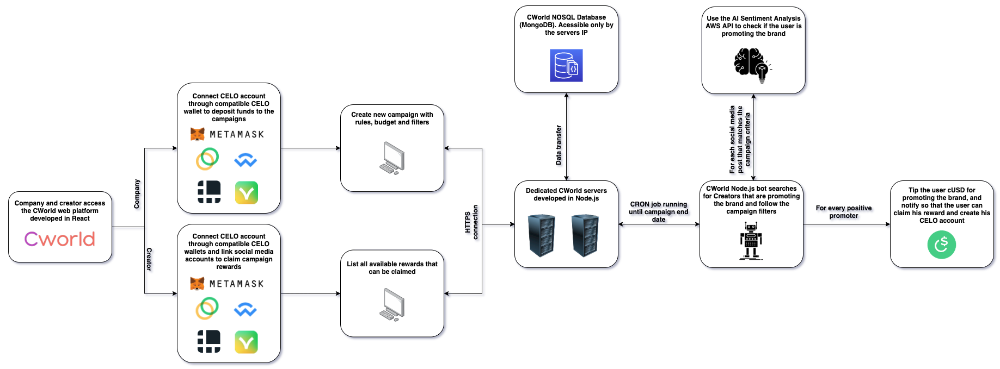

# CWorld

C World is a platform where any brand that wants to promote a marketing campaign is able to properly reward creators that are actually making the difference. Regardless of country, ethnicity, beliefs and numbers of followers.

The project is devided in 2 parts, beeing them:

 1. **BACKEND**
 2. **FRONTEND**
 
 

## Playing locally the BE

run the server in development mode.

bash
$ npm run dev
Express server listening on http://0.0.0.0:8000, in development mode

If you choose to generate the authentication API, you can start to play with it.
> Note that creating and authenticating users needs a master key (which is defined in the `.env` file)

## Directory structure
### src/api/

Here is where the API endpoints are defined. Each API has its own folder.

#### src/api/some-endpoint/model.js

It defines the Mongoose schema and model for the API endpoint. Any changes to the data model should be done here.

#### src/api/some-endpoint/controller.js

This is the API controller file. It defines the main router middlewares which use the API model.

#### src/api/some-endpoint/index.js

This is the entry file of the API. It defines the routes using, along other middlewares (like session, validation etc.), the middlewares defined in the `some-endpoint.controller.js` file.

### services/

Here you can put `helpers`, `libraries` and other types of modules which you want to use in your APIs.

## Playing locally the FE

npm start
Runs the app in the development mode.
Open http://localhost:3000 to view it in the browser.

The page will reload if you make edits.

